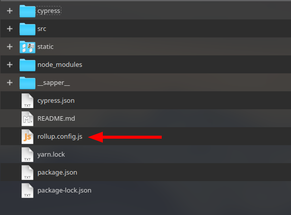
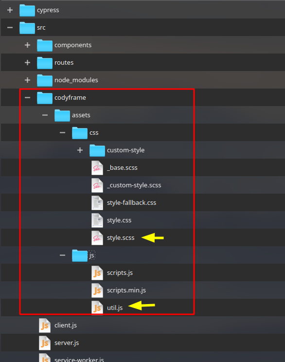
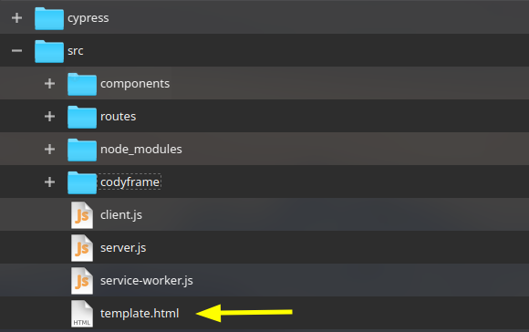
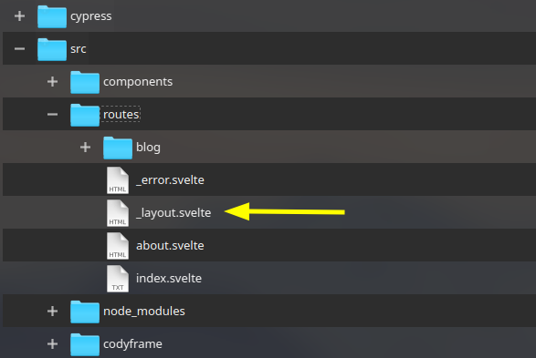
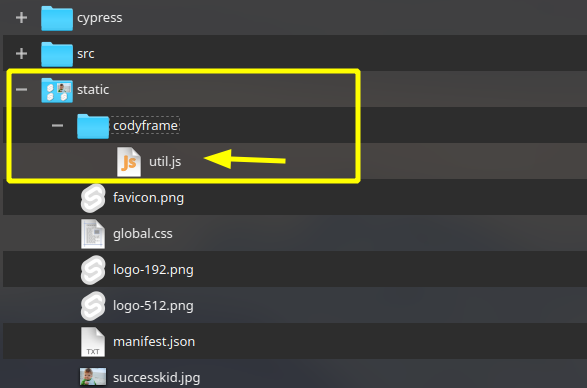

## Sapper + Codyframe


This project is a template for Sapper if you want to work with CodyFrame framework UI ([From Cody House](https://codyhouse.co/ds/docs/framework)), And you want to compile the **SASS files** and using it directly with **Rollup** 👌

-------------------------------

> Note: You can use this template directly or you can follow the instructions below 🍵

-------------------------------

### First things 🤚
After getting the template of [sapper](https://sapper.svelte.dev/) for Rollup by:

👉 `npx degit "sveltejs/sapper-template#rollup" my-app`

You have to install the ordinary dependencies by:

👉 `npm install`

And try to run it _(on http://localhost:3000)_ by:

👉 `npm run dev`

### Issues could happen 📛
If you have this issue:

*[UnhandledPromiseRejectionWarning: Error: No valid exports main found for /..node_modules/@rollup/pluginutils](https://github.com/sveltejs/sapper/issues/1257)*

Just remove the `rollup` package from npm and reinstall a new version of it like *"2.13.0"*.

Also if you don't have **Polka** install it by:

`npm install --save polka`

You can use **express js** 🌱 instead of *Polka*, learn how to do that from this [Youtube video](https://youtu.be/kiou6WVYswM)

### Dependencies for SASS compiler 🏵️
* svelte-preprocess 👈
* autoprefixer 👈
* node-sass 👈

`npm install -D node-sass autoprefixer svelte-preprocess`

or

`yarn add -D node-sass autoprefixer svelte-preprocess`

### Rollup Configurations 🦊



Inside the **rollup.config.js** file, add these lines outside of *export default* to be accessible globally:

```js
// for sass (codyframe)
import sveltePreprocess from 'svelte-preprocess';
const preprocess = sveltePreprocess({
  scss: {
    includePaths: ['src'],
  },
  postcss: {
    plugins: [require('autoprefixer')],
  },
});
```

Also add these lines in both 🤠 ***Client and Server*** sections inside of **svelte({...})**:

```js
svelte({
  ...
  preprocess // Add this line
  ...
}),
```

### Get the CodyFrame 🤦‍♂
Clone the official project from GitHub: [Here](https://github.com/CodyHouse/codyhouse-framework)

We just want the **assets** folder 🙄, So copy it inside ***codyframe*** folder in your ***src*** folder _(src/codyframe)_ .

We want the *style.scss* and *util.js* later 👌.



### Sapper Tepmlate File 🍪



In the top of *template.html* file in the *src* folder, We have to add a `class="js"` attribute to the `<html ..>` tag:

```html
<html class="js">
```

### Sapper Layout File 🐧



In **_layout.svelte** file inside of *routes* folder, We want to be sure that codyframe script run after the DOM is loaded 👧, So for that we have to use `onMount` from svelte just like this:

```js
<script>
  import { onMount } from "svelte";

  let codyFrameScripts = "";
  onMount(async () => {
    // ---- To mount the CodyFrame scripts ----
    codyFrameScripts = "codyframe/util.js";
  });
</script>
```

Then we can now add the javascript libraries to the head tag like that:

```html
<!--  cody framework - js libraries -->
<svelte:head>
    <script defer src={codyFrameScripts}></script>
</svelte:head>
```

 And of course we have also to import the scss style 🌻!

```html
<!-- Codyframework Global Scss -->
<style lang="scss" global>
@import "./codyframe/assets/css/style.scss"
</style>
```

### Last Step! 🤗
Don't forget to add ***util.js*** inside of `codyframe` folder in the **static** folder of your project 👈.



### Testing! 👍

In your *`index.svelte`* route, Add any code to test codyframe components, Like this Button:

```html
 <div><button class="btn btn--primary btn--md">Zaki Button!</button></div>
```

### One more thing! 👎
The codyhouse doesn't have components for modern JavaScript frameworks like *Svelte/Vue/React ..*, And also his bad JavaScript functionality run one time when the page is loaded 🤦‍♂

So you'll get a lot of troubles when you work with a SPA project (Single Page Application), But there is a solution out of the box from sapper 💕

Each time you have to switch to another route, You have to be sure that the link (for example) `<a href="/profile">` has a `rel="external"` attribute:

```html
<a rel="external" href="/profile">
```

#### Enjoy! You can buy me a [coffee 🐿](https://paypal.me/zakariachahboun) 💕

-----------------------------
Big Thanks to *Sean Schertell*, He wrote a great [article](https://medium.com/@sean_27490/svelte-sapper-with-sass-271fff662da9) about Sapper & Sass :blush: 

Also Thanks to [@HamzaPlus](https://github.com/HamzaPlus) for the IDEA :blush:


My twitter [Zakaria Chahboun](https://twitter.com/zaki_chahboun)
